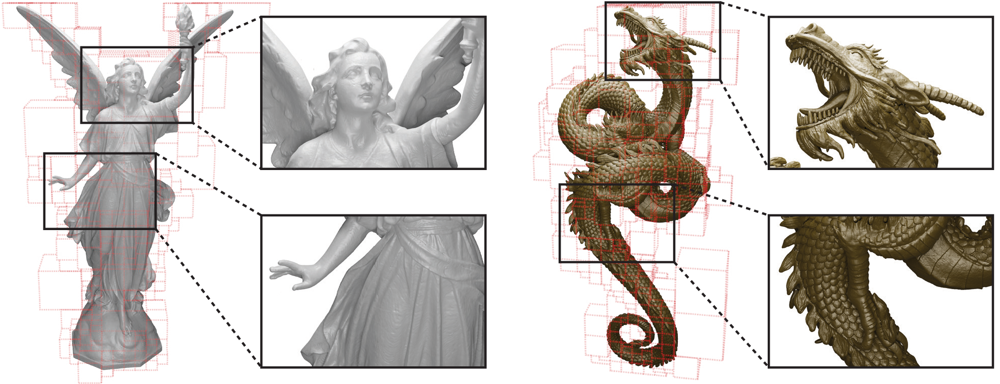

# ACORN: Adaptive Coordinate Networks for Neural Scene Representation <br> SIGGRAPH 2021
### [Project Page](http://www.computationalimaging.org/publications/acorn/) | [Video](https://www.youtube.com/watch?v=P192X3J6cg4) | [Paper](https://arxiv.org/abs/2105.02788)
[](https://colab.research.google.com/github/computational-imaging/automatic-integration/blob/master/acorn_example.ipynb)<br>
PyTorch implementation of ACORN.<br>
[ACORN: Adaptive Coordinate Networks for Neural Scene Representation](http://www.computationalimaging.org/publications/acorn/)<br>
 [Julien N. P. Martel](http://web.stanford.edu/~jnmartel/)\*,
 [David B. Lindell](https://davidlindell.com)\*,
 [Connor Z. Lin](https://connorzlin.com/),
 [Eric R. Chan](https://ericryanchan.github.io/about.html),
 [Marco Monteiro](https://twitter.com/monteiroamarco),
 [Gordon Wetzstein](https://computationalimaging.org)<br>
 Stanford University <br>
  \*denotes equal contribution  
in SIGGRAPH 2021



## Quickstart

To get started quickly, we provide a collab link above. Otherwise, you can clone this repo and follow the below instructions. 

To setup a conda environment, download example training data, begin the training process, and launch Tensorboard, follow the below commands. As part of this you will also need to [register for and install an academic license](https://www.gurobi.com/downloads/free-academic-license/) for the Gurobi optimizer (this is free for academic use). 
```
conda env create -f environment.yml
# before proceeding, install Gurobi optimizer license (see above web link)
conda activate acorn 
cd inside_mesh
python setup.py build_ext --inplace
cd ../experiment_scripts
python train_img.py --config ./config_img/config_pluto_acorn_1k.ini
tensorboard --logdir=../logs --port=6006
```

This example will fit 1 MP image of Pluto. You can monitor the training in your browser at `localhost:6006`. 

### Adaptive Coordinate Networks

An adaptive coordinate network learns an adaptive decomposition of the signal domain, allowing the network to fit signals faster and more accurately. We demonstrate using ACORN to fit large-scale images and detailed 3D occupancy fields. 

#### Datasets

Image and 3D model datasets should be downloaded and placed in the `data` directory. The datasets used in the paper can be accessed as follows. 

- Public domain image of Pluto is included in the repository *(NASA/Johns Hopkins University Applied Physics Laboratory/Southwest Research Institute/Alex Parker)*
- [Gigapixel image of Tokyo](https://drive.google.com/file/d/1ITWSv8KcZ_HPNrCXbbbkwzXDSDMr7ACg/view?usp=sharing) *(Trevor Dobson [CC BY-NC-ND 2.0](https://creativecommons.org/licenses/by-nc-nd/2.0/) image resized from [original](https://www.flickr.com/photos/trevor_dobson_inefekt69/29314390837))*
- Public domain [Gigapixel image of Mars](https://drive.google.com/file/d/1Ro1lWxRsl97Jbzm9EA2k9nUEyyVUwxEu/view?usp=sharing) *(NASA/JPL-Caltech/MSSS)*
- Blender engine model [.obj](https://drive.google.com/file/d/1NU2I1Vly6X7YZWD1z_JiBx67XSJ_iR8d/view?usp=sharing), [.blend](https://www.blendswap.com/blend/17636) *(ChrisKuhn [CC-BY](https://creativecommons.org/licenses/by/2.0/))*
- Lucy dataset [.ply](http://graphics.stanford.edu/data/3Dscanrep/) (Stanford 3D Scanning Repository)
- Thai Statue dataset [.ply](http://graphics.stanford.edu/data/3Dscanrep/) (Stanford 3D Scanning Repository)
- Dragon dataset ([TurboSquid](https://www.turbosquid.com/3d-models/chinese-printing-3d-model-1548953))
 
#### Training

To use ACORN, first set up the conda environment and build the Cython extension with  
```
conda env create -f environment.yml
conda activate acorn 
cd inside_mesh
python setup.py build_ext --inplace
```

Then, download the datasets to the `data` folder. 

We use Gurobi to perform solve the integer linear program used in the optimization. A free academic license can be installed from [this link](https://www.gurobi.com/downloads/free-academic-license/).

To train image representations, use the config files in the `experiment_scripts/config_img` folder. For example, to train on the Pluto image, run the following
```
python train_img.py --config ./config_img/config_pluto_1k.ini
tensorboard --logdir=../logs/ --port=6006
```

After the image representation has been trained, the decomposition and images can be exported using the following command.

```
python train_img.py --config ../logs/<experiment_name>/config.ini --resume ../logs/<experiment_name> <iteration #> --eval
```

Exported images will appear in the `../logs/<experiment_name>/eval` folder, where `<experiment_name>` is the subdirectory in the `log` folder corresponding to the particular training run.

To train 3D models, download the datasets, and then use the corresponding config file in `experiment_scripts/config_occupancy`. For example, a small model representing the Lucy statue can be trained with 

```
python train_occupancy.py --config ./config_occupancy/config_lucy_small_acorn.ini
```

Then a mesh of the final model can be exported with
```
python train_occupancy.py --config ../logs/<experiment_name>/config.ini --load ../logs/<experiment_name> --export
```

This will create a `.dae` mesh file in the `../logs/<experiment_name>` folder.

## Citation

```
@article{martel2021acorn,
  title={ACORN: {Adaptive} coordinate networks for neural scene representation},
  author={Julien N. P. Martel and David B. Lindell and Connor Z. Lin and Eric R. Chan and Marco Monteiro and Gordon Wetzstein},
  journal={ACM Trans. Graph. (SIGGRAPH)},
  volume={40},
  number={4},
  year={2021},
}
```
## Acknowledgments

We include the MIT licensed `inside_mesh` code in this repo from Lars Mescheder, Michael Oechsle, Michael Niemeyer, Andreas Geiger, and Sebastian Nowozin, which is originally included in their [Occupancy Networks repository](https://github.com/autonomousvision/occupancy_networks/tree/ddb2908f96de9c0c5a30c093f2a701878ffc1f4a/im2mesh/utils/libmesh
).

J.N.P. Martel was supported by a Swiss National Foundation (SNF) Fellowship (P2EZP2 181817). C.Z. Lin was supported by a David Cheriton Stanford Graduate Fellowship. G.W. was supported by an Okawa Research Grant, a Sloan Fellowship, and a PECASE by the ARO. Other funding for the project was provided by NSF (award numbers 1553333 and 1839974).


